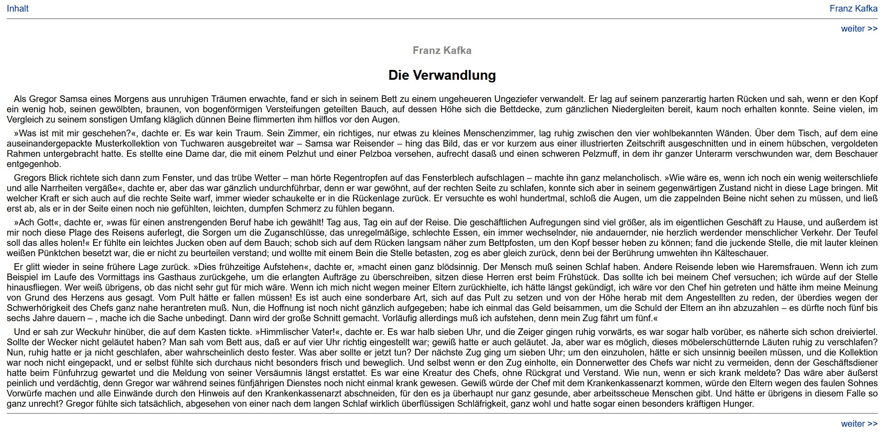
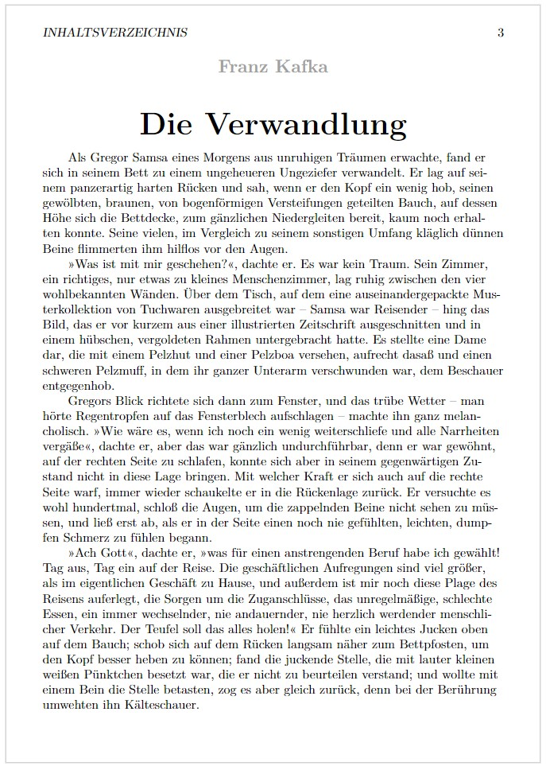

EBookCrawler is a C# console application that scrapes 
texts of the archive
[Projekt Gutenberg](https://www.projekt-gutenberg.org/)
and transcripts the html texts to latex code.

EBookCrawler uses an (experimental and hand-written) HTML-Parser for scraping.
For transcripting html pages to latex files it uses a heuristic algorithm to achieve
better results than default html-to-pdf conversions.
The generated documents are optimized for small e-book readers.

Note: I couldn't test the quality of the generated latex files for each text in Projekt Gutenberg.
In most cases, EBookCrawler will generate a correct latex file, however in some cases the generated latex file may not be compilable.
In those cases, compilation usually fails because of small errors in the tex file that can easily be fixed by hand.

# Example
First part of Kafka, die Verwandlung. Normal display in the browser.

First page of the pdf file of the same text after EBookCrawler converted it to a latex file.

# Usage

# Installation
