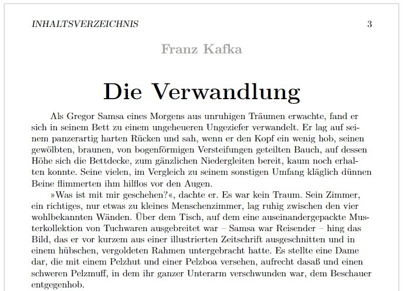

# EBookCrawler
EBookCrawler is a C# console application that scrapes 
texts of the archive
[Projekt Gutenberg](https://www.projekt-gutenberg.org/)
and transcripts the html texts to latex code.

EBookCrawler uses an (experimental and hand-written) HTML-Parser for scraping.
For transcripting html pages to latex files it uses a heuristic algorithm to achieve
better results than default html-to-pdf conversions.
The generated documents are optimized for small e-book readers.

Note: I couldn't test the quality of the generated latex files for each text in Projekt Gutenberg.
In most cases, EBookCrawler will generate a correct latex file, however in some cases the generated latex file may not be compilable.
In those cases, compilation usually fails because of small errors in the tex file that can easily be fixed by hand.

## Example
First part of Kafka, die Verwandlung. Normal display in the browser.


First page of the pdf file of the same text after EBookCrawler converted it to a latex file.


## Usage

To use this software download
the released binaries and call EBookCrawler.exe from the command line.

When using for the first time, you need to initially create a text library on your system.
For this end, call
```
EBookCrawler.exe init "C:\path\to\my\library"
```
where "C:\path\to\my\library" is a path to an existing folder.
The program will then scrape the website of Projekt Gutenberg and save all necessary
html files in the given folder. This may take 30 minutes up to several hours (depending on your internet connection).

After that, call
```
EBookCrawler.exe books "title" "C:\path\to\my\library" "C:\path\to\my\latex\files"
```
where "C:\path\to\my\library" is the path to the previously downloaded library
and "C:\path\to\my\latex\files" is a path to an existing folder where the software
shall write the new latex files.
The software will search library for books whose title contain the substring "title"
and produce latex files for each found text.

Alternatively, you can call
```
EBookCrawler.exe author "name" "C:\path\to\my\library" "C:\path\to\my\latex\files"
```
In this case, the software will search for all authors whose name contains "name" as a substring and will transform all of their works to Latex.

